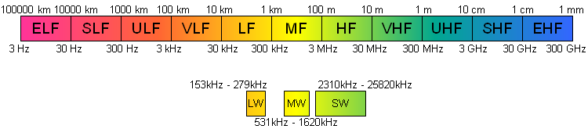
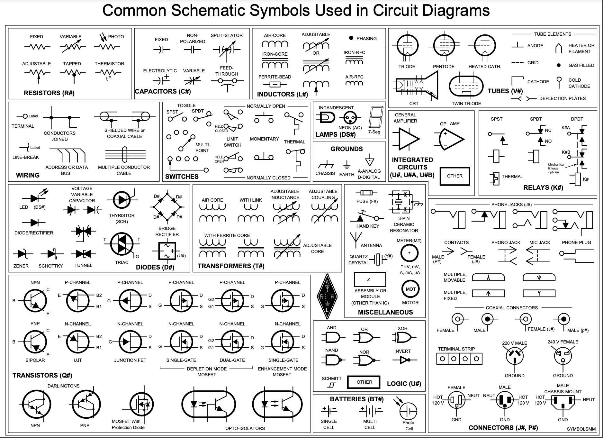

<h1 align="center">Ham Technician Study Notes</h1>

<i>Notes for the Ham Technican exam between July 1, 2022 and Jume 30, 2026</i>

# Visual References

    
<b>US Amateur Radio Bands</b>

    

    
<b>Radio Spectrum</b>

    

    
<b>Schematic Symbols Used in Circuit Diagrams</b>

    

 

# Terms
- Gain - Concentrating an antenna's radiated signals in a specific direction. This aids communication in that direction by increasing transmitted and received signals.
- Standing Wave Ratio (SWR) - The ratio of the maximum value to minimum value of the interference pattern. This also measures how well the antenna (load) and feed line impedances are matched.
- Perfect Match - When there is no reflected power and no interference pattern and the SWR is 1:1.
Impedance mismatch or mismatch - SWR greater than 1:1.
- Inductive Loading - An antenna with some of the radiating conductor wound into a coil or a separate inductor inserted into the antenna with the goal of reducing the physical size of the antenna.
- Bandwidth - The range of frequencies over which as signal is spread. This is calculated by subtracting the lowest frequency from the highest.
- Composite Signal - A signal made up of multiple different signals called components (EX: Speech).
- Modulation - Adding information to a signal by changing it in some way. The characteristics of a signal that can be modulated are amplitude (Strength), frequency, and phase.
- Continuous Wave (CW) - The simplest radio signal with a strength and frequency that never change.

# Formulas
## Wavelength
``lambda = c / f``

Where:
- Lambda is the distance the wave travels during one cycle.
- c is the speed of light.
- f is frequency.

Note: Where f is represented in MHz, c is 300.
## Ohms Law
``I = E / R``

Where:
- I is current.
- E is applied voltage.
- R is resistance,

## Calculating Power
``P = I * E``

Where:
- P is power or the rate at which electrical energy is used.
- I is current.
- E is applied voltage.

## Calculating dB
For power ratio: ``dB = 10 log``

For voltage ratio: ``dB = 20 log``

## Calculating Dipole Antenna Length
``Length (in feet) = 468 / f``

Where:
- f is the target frequency in MHz.

Note: The estimates of this formula are often too short for HF.

## Calculating Ground-Plane Antenna Length
``Length (in feet) = 234 / f``

Where:
- f is the target frequency in MHz.

Note: The estimates of this formula are often too short for HF.

# Notes
- Feed lines use special materials and construction to minimize power being dissipated as feed line loss and avoid signals leaking in or out.
- Feed line loss increases with frequency for all types of feed lines.
- Coaxial hardline limits the amount of bending, but also has the lowest loss of any type of coaxial feed line.
- Most coaxial cable used in ham has a characteristic impedance of 50 ohms. This is a measure of how energy is carried by the feed line.
- External SWR meter need to be specified for the frequency range in use to ensure accurate measurements.
- Low SWR indicated efficient transfer of power from feed line because less power is reflected by the antenna. This translates into less loss from reflected power traveling back and fourth between the antenna and transmitter in the feed line.
- Rosin-core solder should be used for radio and electronics applications. Acid-core solder should not be used.
- Wattmeters can be used in-line to measure feed line power in both directions. Tables and formulas can be used to convert power readings to SWR.
- Amplitude modulation is composed of a carrier signal (constant), and upper side band (USB) and a lower side band (LSB) frequency which are higher and lower in frequency than the carrier respectively.
- Single-Sideband - Signals where one of the sidebands is suppressed. IN VHF and UHF the USB is used and with MF and HF bands the USB and LSB are used.
- 