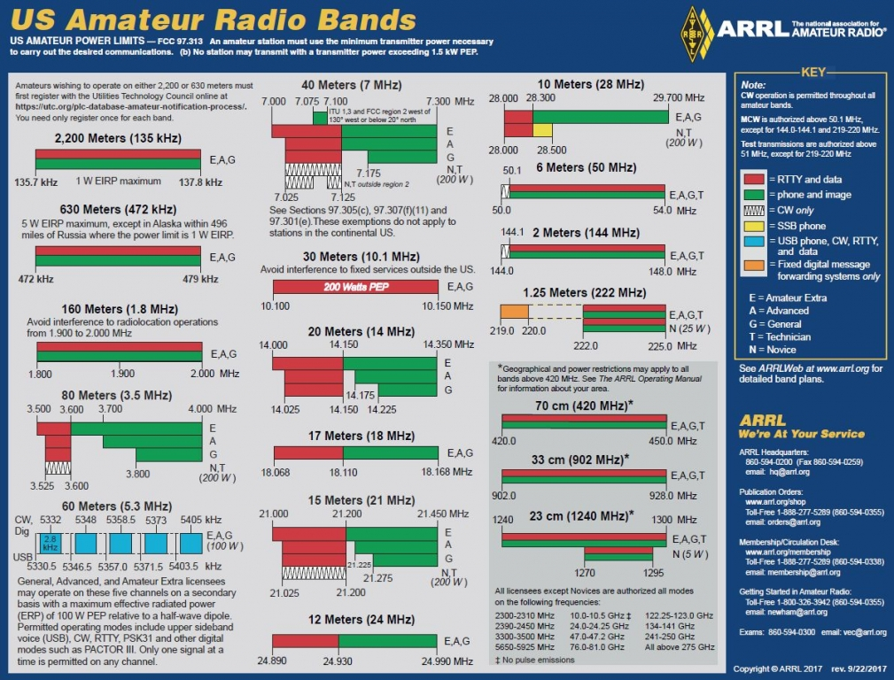

<h1 align="center">Ham Technician Study Notes</h1>

<i>Notes for the Ham Technican exam between July 1, 2022 and Jume 30, 2026</i>

# Visual References

## US Amateur Radio Bands

## Schematic Symbols Used in Circit Diagrams

# Terms
- 

# Formulas
## Wavelength
``lambda = c / f``

Where:
- Lambda is the distance the wave travels during one cycle.
- c is the speed of light.
- f is frequency.

Note: Where f is represented in MHz, c is 300.
## Ohms Law
``I = E / R``

Where:
- I is current.
- E is applied voltage.
- R is resistence,

## Calculating Power
``P = I * E``

Where:
- P is power or the rate at which electrical energy is used.
- I is current.
- E is applied voltage.
